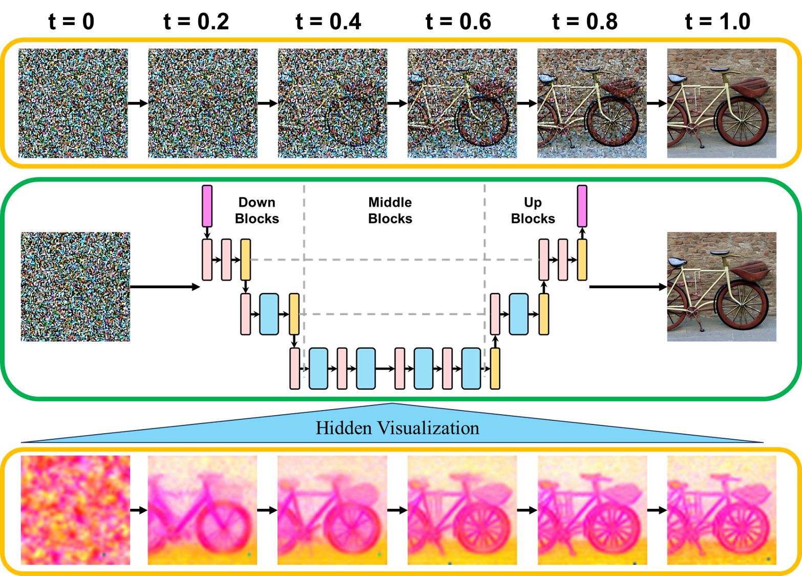
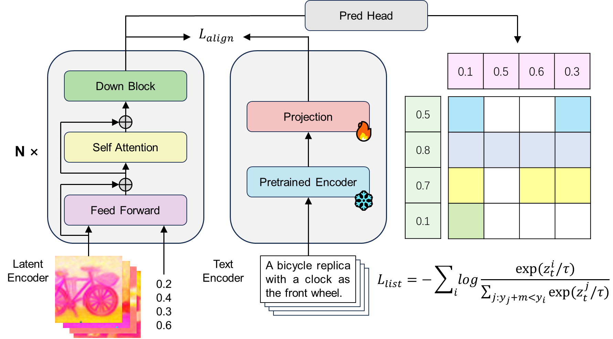

# Toward Early Quality Assessment of Text-to-Image Diffusion Models (CVPR 2026)

## Overview

**ProbeSelect** enables early quality prediction for text-to-image diffusion models. Instead of completing the full denoising process before assessing image quality, ProbeSelect predicts the final image quality at approximately **20% of the denoising progress**, allowing efficient selection of high-quality candidates while significantly reducing computational cost.

<p align="center">
  
</p>

The method extracts intermediate features from the diffusion model's transformer/UNet layers, applies PCA for dimensionality reduction, and uses a lightweight probe head to predict quality scores. The probe head is trained to regress human preference scores (e.g., ImageReward).

<p align="center">
  
</p>

## Quick Start

### Installation

```bash
pip install -r requirements.txt
```

### Download Pretrained Models

1. **Base Model**: Download [Stable Diffusion 3.5 Large](https://huggingface.co/stabilityai/stable-diffusion-3.5-large) from HuggingFace.

2. **ImageReward**: Download [ImageReward](https://huggingface.co/THUDM/ImageReward) model for text embedding.

3. **ProbeSelect Checkpoint**: Place the checkpoint at `workdir/SD3L_IR_ema.ckpt`.

### Inference

Run inference with ProbeSelect enabled:

```bash
python test.py \
    --model_path /path/to/stable-diffusion-3.5-large \
    --ckpt_path workdir/SD3L_IR_ema.ckpt \
    --prompt "a beautiful landscape" \
    --enable_probe_select \
    --num_images_per_prompt 5 \
    --num_select 1 \
    --output_dir outputs
```

**Key Parameters:**

| Parameter | Description |
|-----------|-------------|
| `--enable_probe_select` | Enable early quality selection |
| `--num_images_per_prompt` | Number of candidate images to generate per prompt |
| `--num_select` | Number of top-quality images to select from candidates |
| `--prompt` | Text prompt(s) for image generation |

## Train from Scratch

### Data Preparation

> **Note:** Data preparation is computationally expensive and time-consuming. Both image generation (running the diffusion model on large-scale prompts) and quality score computation (running multiple evaluators including CLIP, ImageReward, HPS, PickScore, etc.) require significant GPU resources and time.

Taking SD3-L as example, training data preparation consists of two steps:

**Step 1: Generate images and intermediate latents**

Run the diffusion model to generate images while extracting PCA-reduced latent features at multiple timesteps:

```bash
cd src/data_gen

python generate_SD3_L_img_only.py \
    --model-path /path/to/stable-diffusion-3.5-large \
    --prompt-path /path/to/prompts.txt \
    --save-path /path/to/output_raw \
    --batch-size 2 \
    --num-imgs-per-prompt 5 \
    --num-infer-steps 28 \
    --record-start-ratio 0.05 \
    --record-step-interval 2 \
    --device cuda:0
```

**Step 2: Compute quality scores**

```bash
cd src/data_gen

python convert.py \
    --raw-path /path/to/output_raw \
    --out-path /path/to/output_scored \
    --start $START_FILE_ID \
    --end $END_FILE_ID \
    --device cuda:0
```

The `convert.py` script computes the following quality metrics for each image:
- CLIP Score (ViT-B/16, ViT-B/32)
- Aesthetic Score
- PickScore
- ImageReward
- HPS v2.0 / v2.1
- BLIP ITC / ITM

### Training

Training uses [Hydra](https://hydra.cc/) for configuration management and [PyTorch Lightning](https://lightning.ai/) for training.


**Stable Diffusion 3.5 Large:**

```bash
torchrun --standalone --nproc_per_node=4 src/train.py \
    trainer.devices=auto \
    data.args.batch_size=16 \
    model.args.optimizer_para.lr=1e-5 \
    task_name=SD3_L \
    data.args.start_step=$START_STEP \
    data.args.end_step=$END_STEP \
    data.args.num_files=$NUM_FILES \
    data.args.num_workers=4 \
    data.args.known_ts=$KNOWN_TS \
    paths.data_dir=/path/to/SD3_L_data
```

**Key Training Parameters:**

| Parameter | Description |
|-----------|-------------|
| `data.args.start_step` | Start timestep index for training data (should match `record-start-ratio` × `num-infer-steps` in data generation) |
| `data.args.end_step` | End timestep index for training data |
| `data.args.known_ts` | List of normalized timesteps (t / num_inference_steps) at which features were recorded during data generation |
| `data.args.num_files` | Number of data files to use for training |
| `paths.data_dir` | Path to the scored training data (output of `convert.py`) |

## Citation

If you find our work helpful, please consider citing us:

```bibtex
@article{probeselect2025,
  title={Toward Early Quality Assessment of Text-to-Image Diffusion Models},
  author={Guo, Huanlei and Wei, Hongxin and Jing, Bingyi},
  booktitle={Proceedings of the IEEE/CVF Conference on Computer Vision and Pattern Recognition},
  year={2026}
}
```
